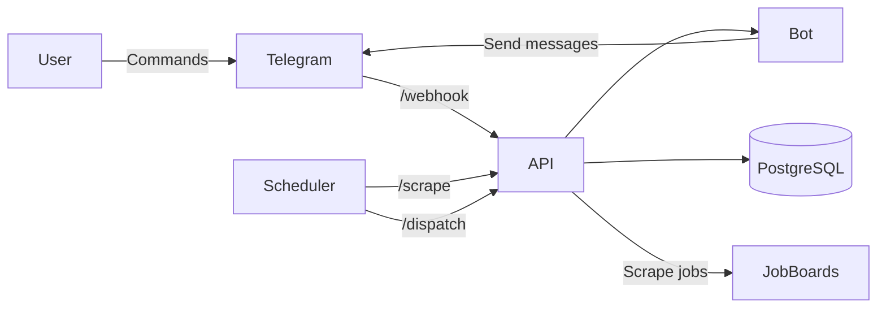

# IT Jobs Worldwide Bot

[Telegram](t.me/ITJobsWorldwideBot)

A distributed job notification system that scrapes job boards and delivers personalized alerts via Telegram.
The system is designed to handle asynchronous scraping, fair notification distribution across users, and external API rate limits in a serverless environment.

## Architecture

The system consists of:

- Telegram Bot (aiogram) – user interaction
- FastAPI service – webhook handling and internal endpoints
- Background pipelines – scraping and notification dispatch
- PostgreSQL – persistent storage
- Cloud Scheduler – triggers periodic jobs

### Key Design Decisions

- **Async architecture**
  Built using asyncio and async DB sessions to efficiently handle concurrent scraping and notification dispatch.

- **Fair notification dispatching**
  Implemented round-robin batching across users to prevent a single user with many notifications from dominating the system.

- **Rate limiting**
  Applied both global and per-user rate limits to comply with Telegram API constraints. Scrapping domains is also rate limited to not get blocked.

- **Serverless deployment**
  Deployed on GCP Cloud Run for automatic scaling and cost efficiency.

- **Connection handling**
  Configured SQLAlchemy pooling (`pool_pre_ping`, `pool_recycle`) to handle stale connections in serverless environments.

## Features

### API

Endpoints:
- /webhook - for incoming Telegram bot updates
- /scrape - triggers scraping pipeline
- /dispatch - triggers job alerts delivery

### Bot
Commands:
- /start - just a greeting message
- /subscribe <category> <location> - register for receiving job alerts
- /unsubscribe <category> <location> - cancel subscription
- /mysubscriptions - list active subscriptions
- /categories - list supported categories
- /help - usage guide

For active subscriptions the bot delivers updates about new jobs found.

### DB

Tables:
- users
- jobs
- user_subscriptions
- notifications

## Deployment

- Application and bot are deployed as a single service on Cloud Run
- Two scheduled jobs trigger:
  - scraping new jobs
  - dispatching notifications

The system is designed to work within serverless constraints such as:
- cold starts
- ephemeral instances
- connection lifecycle management

## Workflow

1. User subscribes via Telegram bot
2. Scheduler triggers scraping pipeline
3. New jobs are stored in the database
4. Notifications are created for matching subscriptions
5. Dispatcher sends notifications in fair, rate-limited batches

## Stack
### Python:
  - FastAPI
  - aiogram
  - asyncio
  - aiohttp
  - pytest
  - loguru
### GCP
  - Cloud Run
  - Cloud Scheduler
